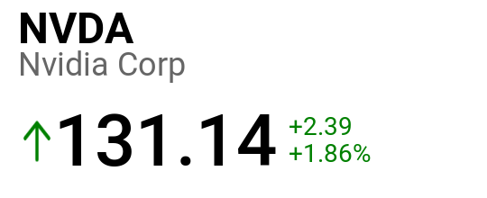

# Stock Banner

### Prerequisites
- Alpaca API Keys
- Polygon API Key

### Installation
```shell
git clone https://github.com/iamarpitpatidar/stock-banner.git
cd stock-banner

# Install Deps
composer install

# Create .env file and update API Keys (Alpaca and polygon)
cp .env.example .env

# Migrate the database
php artisan migrate --seed

# Run the app
php artisan serve

# Add Cron for Scheduler and Laravel Jobs for below commands
php artisan scheduler:run
php artisan queue:work

# Check output on url {domain}/ticker/{ticker}
# example: https://arpitpatidar.com/ticker/aapl
```

### Output

